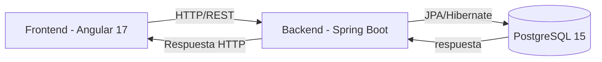

# 📘 Manual de Instalación y Uso

## ✅ Requisitos Previos
Antes de iniciar, asegúrate de tener instalado:

- **Java 17+** (para ejecutar Spring Boot).
- **Maven** (para compilar y manejar dependencias del backend).
- **Node.js 18+** (runtime del frontend).
- **Angular CLI 17** (para ejecutar y compilar el frontend).
- **Docker y Docker Compose** (para contenerización).
- **PostgreSQL 15**.
- **Git** (para clonar el repositorio).

---

## 🛠️ Tecnologías Utilizadas
- **Angular 17** (frontend).
- **Spring Boot** (backend).
- **PostgreSQL 15** (base de datos).
- **Docker y Docker Compose** (contenedores).
- **Node.js** (runtime y dependencias del frontend).
- **Maven** (gestión de dependencias en el backend).
- **Git** (control de versiones).
- **Angular Material (MatDialog)** (modales).
- **Lombok** (reducción de código boilerplate en el backend).
- **Hibernate / JPA** (persistencia de datos).

---

## ⚙️ Proceso de Instalación

1. **Clonar el repositorio**
   ```bash
   git clone https://github.com/JEGarciaY/PruebaPlaytech.git
   cd PruebaPlaytech
   ```

2. **Crear instancia de postgres en docker**
   ```bash
     docker-compose up -d 
   ```

3. **Instalar dependencias del backend**
   ```bash
   cd back
   mvn clean install
   ```

4. **Instalar dependencias del frontend**
   ```bash
   cd front
   npm install
   ```


---

## 🚀 Uso del Sistema

- Frontend disponible en: **http://localhost:4200**  
- Backend disponible en: **http://localhost:8080**

## 🗄️ Script de Usuarios

- Para acceder a la aplicación es necesario ejecutar el archivo **script_users.sql** en la base de datos, el cual se encarga de crear los usuarios iniciales.

## 🔑 Funcionalidades

- **Crear producto:** Agregar nombre, stock, precio y descripción.  
- **Actualizar producto:** Editar información existente.  
- **Eliminar producto:** Quitar un producto del inventario (con confirmación).  
- **Vender producto:** Abrir el modal, ingresar cantidad y confirmar; descuenta del stock.
- **Crear usuario:** Agregar nombre de usuario, contraseña y rol
- **Actualizar usuario:** Editar información existente.  
- **Eliminar usuario:** Quitar un usuario del sistema (con confirmación).

## 🚹 Roles del sistema

- **Administrador:** Tiene acceso a todo el sistema.
- **Cajero:** Tiene acceso a la venta de productos y la información de las ventas realizadas, negándole el acceso a la adición, edición y eliminación de productos y a todo lo referente a usuarios del sistema.

---

## 📊 Arquitectura del Sistema



---

## 📌 Conclusión
Este sistema implementa un flujo completo de gestión de productos con **Angular 17** en el frontend, **Spring Boot** en el backend, base de datos en **PostgreSQL 15**, y orquestación con **Docker Compose**.  
